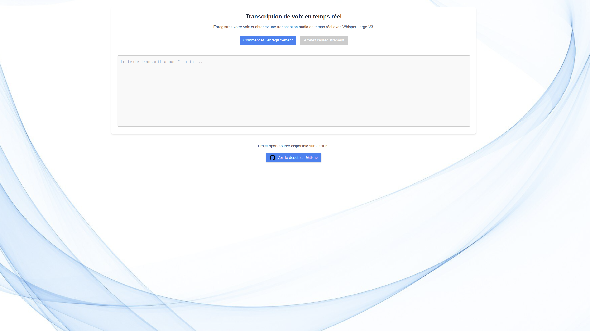

# Projet Django - Transcription en Temps Réel avec Whisper

Ce projet implémente un service de transcription en temps réel en utilisant le modèle Whisper d'OpenAI. Il permet de transcrire des fichiers audio en texte en temps réel, grâce à une API construite avec Django. L'application est conçue pour être flexible, scalable et facile à intégrer dans des environnements de production.

## Fonctionnalités

- Transcription en temps réel de fichiers audio
- Utilisation du modèle Whisper pour la conversion audio -> texte
- Communication en temps réel au microphone intégré du naviagateur avec ASGI et Websocket.
- Interface simple pour démarrer une transcription et récupérer les résultats

## Visualisation :

Voici ce que vous devriez voir une fois sur http://127.0.0.1:8000/.



## Prérequis

Avant de commencer, vous devez installer et configurer les éléments suivants :

- **Python 3.9+** : Assurez-vous que Python est installé sur votre machine.
- **Django** : Le framework web utilisé pour ce projet.
- **Whisper** : Le modèle de transcription développé par OpenAI.
- **Dépendances supplémentaires** : Pour gérer l'audio, la gestion des API et d'autres fonctions.

## Installation

1. **Clonez le dépôt** :

   Clonez ce projet sur votre machine locale en utilisant Git :

   ```bash
   git clone https://github.com/Benjamin-Poutout/whisper-transcription-french-django.git
   cd whisper-transcription-french-django
   ```

2. **Créez un environnement virtuel** :
   
   ```bash
   python3 -m venv venv
   source venv/bin/activate  # Sur Windows, utilisez 'venv\Scripts\activate'
   ```

3. **Installer les bibliothèques nécesaires** :

   ```bash
   pip install -r requirements.txt
   ```

4. **Configuration de Whisper** :
   Le projet utilise le modèle Whisper d'OpenAI pour la transcription. Vous devrez installer et configurer Whisper. Vous pouvez utiliser la version disponible sur Whisper GitHub.
   Pour installer Whisper, exécutez la commande suivante :

   
   ```bash
   pip install git+https://github.com/openai/whisper.git
   ```
## Lancer le projet :

1. **Appliquez les migrations de base de données** :
   
   Exécutez la commande suivante pour appliquer les migrations de base de données :
   
   ```bash
   python manage.py migrate
   ```
2. **Démarrez le serveur Django** :

   Lancez le serveur de développement Django avec la commande suivante :

   ```bash
   python manage.py runserver
   ```
   Le serveur sera accessible à l'adresse http://127.0.0.1:8000/.
## API :

Le projet expose une API pour interagir avec le service de transcription en temps réel. Vous pourrez alors enregistrer votre voix et voir la transcription en temps réel s'afficher sur http://127.0.0.1:8000/.

## Contribuer :

Les contributions sont les bienvenues ! Si vous souhaitez contribuer au projet, suivez ces étapes :

1. Forkez ce dépôt
2. Créez une nouvelle branche (git checkout -b feature-xyz)
3. Apportez vos modifications
4. Committez vos changements (git commit -am 'Ajout de nouvelles fonctionnalités')
5. Poussez vos changements sur votre branche (git push origin feature-xyz)
6. Ouvrez une pull request

## Auteurs :

Benjamin Poutout et Gabriel Pizzo


   
